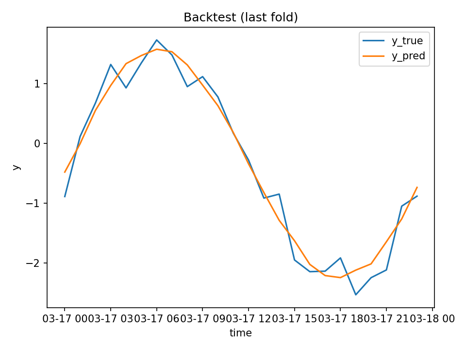

# 🧠 Applied ML Platform — End-to-End Training, Evaluation & Deployment

A **production-grade applied machine learning platform** that demonstrates how real ML systems are built, evaluated, versioned, and served — beyond notebooks and one-off experiments.

This project focuses on **ML system ownership**:
- Reproducible training pipelines
- Leakage-safe evaluation
- Versioned artifacts
- API-based inference
- Runtime model management

---

## 🔖 Badges

<p align="center">
  
  
  
  
</p>

---

## 🌟 Features

  ✔ Config-driven, reproducible ML training  
  ✔ Tabular ML (classification / regression)  
  ✔ Time-series forecasting with walk-forward validation  
  ✔ Versioned model artifacts per run  
  ✔ FastAPI inference service  
  ✔ Runtime model reload without redeploy  
  ✔ Backtest plots & metrics saved automatically  

---

## 🏗 High-Level Architecture

```text
Configs (YAML)
      │
      ▼
Training Pipelines
(tabular | time-series)
      │
      ▼
Model Registry
(artifacts, metadata,
 metrics, backtests)
      │
      ▼
Inference API (FastAPI)
 /predict
 /predict-timeseries
 /reload-model

```
---

## 📦 Project Structure

applied-ml-platform/
│
├── src/
│   ├── data/            # Data generation & feature engineering
│   ├── training/        # Training pipelines per modality
│   ├── models/          # Model registry & artifact handling
│   └── utils/           # Config & metrics helpers
│
├── service/
│   └── app.py           # FastAPI inference service
│
├── configs/             # YAML experiment configs
├── artifacts/           # Versioned model runs
├── tests/               # Smoke & integration tests
└── README.md

---
## 🧠 Supported ML Modalities
### 1️⃣ Tabular Machine Learning

    - Classification / regression

    - Feature shape validation

    - Probability outputs

    - REST-based inference

---

## 2️⃣ Time-Series Forecasting

    - Walk-forward (leakage-safe) cross-validation

    - Lag & rolling-window features

    - Recursive multi-step forecasting

    - Offline backtests saved per run

---

## 📊 Time-Series Backtest (Example)



Automatically generated during training  
(last fold, walk-forward validation):

Each run produces:
- `model.pkl`
- `metadata.json`
- `backtest.csv`
- `backtest.png`

---

## 🚀 Training

### Tabular model training

python -m src.training.train --config configs/example_tabular.yaml

### Time-series model training

python -m src.training.train_timeseries --config configs/example_timeseries.yaml

### Artifacts are stored under:

artifacts/<run_name>/

### The active production model is controlled via:

artifacts/latest.txt

---

## 🌐 Inference Service
### Start the API

uvicorn service.app:app --reload --port 8000

Endpoint	        Method	Description

/health	            GET	    Service & model health
/model-info	        GET   	Active model metadata
/predict	        POST	Tabular inference
/predict-timeseries	POST	Multi-step time-series forecast
/admin/reload-model	POST	Reload active model

### Swagger UI:
http://localhost:8000/docs

---

## 🔄 Model Lifecycle

1. Train model via config

2. Evaluate with offline metrics & backtests

3. Save versioned artifacts

4. Promote model via latest.txt

5. Serve via API

6. Reload model without restarting service

7. This mirrors real production ML workflows.

---
## 🛣 Roadmap

Multimodal ensembles (tabular + time-series)

Drift detection & monitoring

Feature store integration

Batch inference pipelines

Model cards per run

CI validation of training configs

---

### ⭐ If you find this project useful, consider starring the repository.


